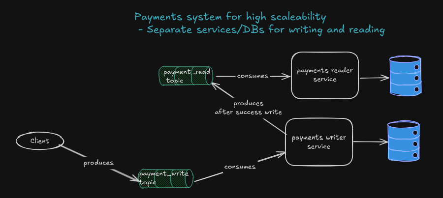

# VoltPay Payment Reader 
This Service is responsible for exposing APIs for reading data for VoltPay payments.
The data is received from read-topic.
There is an idempotency check every time we try to process a message to ensure we don't reprocessed already processed messages.
The reprocessing can happen because of rebalancing, restarts, retries etc.
There is an idempotency job that deletes idempotency records older than one week.
The Kafka consumer consumers messages one by one.

# Architecture

# Kafka
- Consume messages from read-topic.
- Check for idempotency of the message, just in case some messages are re-emitted OR the consumer offset gets moved back
- The topic has 10 partitions with 2 replicas and 1 day retention
- There are 4 Kafka brokers as a start, more can be added in the future
- The key of the message is cust_id so that all events for one customer fall into one partition and are processed sequentially, this ensures to race conditions for a single customer.

# Database
- PostgreSQL is the chosen DB for it reliability and flexibilty.
- Idempotency table consists of Message_ID, DATE
- Table for transactions is to be PARTITIONED, it will reduce contention on the same table and distributed writes to different tables (partitions)
- Tables to be partitioned on a MONTHLY basis by CREATED_AT column
- One downside of partitioning is that the PRIMARY KEY has to also include CREATED_AT column to ensure uniqueness across partitions, making the index bigger
- pgpartman(https://github.com/pgpartman/pg_partman) extension will be used to created and manage partitions, new partitions for the next 2 months will be created at the start of every month

# Liquibase
- The chosen approach for version control of the database
- Easy to use and we have rollbacks it necessary
- We have an audit trail
- It's easy to integrate in the CI/CD and it ensures consistent DB changes across all environments
- Liquibase doesn't directly support schema creation or the management of extensions so they have to be done manually
- otherwise liquibase will throw exception for not existing schema when you execute the scripts, schema CANNOT be created in liquibase
- ChangeSet Ids to be order ascendingly from file to file, if file 1 ends at changeset 3, file 2 needs to start from change 4 to ensure that when querying databasechangelog we can easily track the change
- commands
  - ``gradle update`` -> apply changes
  - ``gradle clearChecksums update`` -> if you change a changelog already execute it will throw an exception when you reexecute it
  - ``gradle rollbackCount -PliquibaseCommandValue=1`` -> very important for rolling back ONE change
  - ``SELECT * FROM databasechangelog ORDER BY dateexecuted DESC;`` -> to monitor when a change was executed

# GraphQL

# Functional Monitoring 
  - KafkaUI -> useful for monitoring topics, messages, consumer offsets. Can also be used for resetting offsets, resetting topics etc.

# General Stuff
- Code Quality
    - Checkstyle is used to enforce standards for code quality
    - use ``gradle checkstyleMain`` to use
    - checkstyle rules can be found in ``config/checkstyle/checkstyle.xml``
- Functional Tests
    - Unit Tests
    - Integration Tests using Testcontainers
        - there is a separate init.sql file for creating schema and tables, so we avoid having to setup pgpartman extension in the test container 

# How to Set up Locally

# Kafka 
- The brokers are set up from voltpay-writer docker compose file, no need to set them in this project
- But this project has to create its topic (read-topic)
- The other topics will be created by the Apps that will use them
- [TOPIC CREATION] ``docker exec -it kafka1 kafka-topics --create --topic read-topic --bootstrap-server kafka1:29092,kafka2:29093,kafka3:29094,kafka4:29095 --partitions 10 --replication-factor 1``
- [DLT TOPIC CREATION] ``docker exec -it kafka1 kafka-topics --create --topic read-dlt --bootstrap-server kafka1:29092,kafka2:29093,kafka3:29094,kafka4:29095 --partitions 4 --replication-factor 1``
- [VERIFY] ``docker exec kafka1 kafka-topics --list --bootstrap-server kafka1:29092``
- [TOPIC DELETION] ``docker exec -it kafka1 kafka-topics --delete --topic read-topic --bootstrap-server kafka1:29092,kafka2:29093,kafka3:29094,kafka4:29095``
- [ALTER PARTITIONS ON TOPIC] ``docker exec -it kafka1 kafka-topics --alter --topic read-topic --partitions 150 --bootstrap-server kafka1:29092,kafka2:29093,kafka3:29094,kafka4:29095``

# PostgreSQL 
- ``docker compose up -d``
- add liquibase dependencies/plugin to build.gradle
- ``gradle build --refresh-dependencies``
- ``gradle update`` OR ``gradle clearChecksums update``(if there is a problem with checksums) - to trigger liquibase scripts
- ``docker exec -it postgres-reader bash``
- [CONNECT TO DB] ``psql -U user -d read_db``
- ``CREATE SCHEMA IF NOT EXISTS read;`` -> general setup for the schema the app will be using
- [REMOVE VOLUME] ``docker volume rm voltpay-reader_readData``
- **[OVERRIDE POSSIBLE NUMBER OF CONNECTIONS]**
- ``docker exec -it postgres-reader bash``
- ``cd /var/lib/postgresql/data``
- ``apt-get update``
- ``apt-get install nano``
- ``nano postgresql.conf``
- ``change max_connections to whatever you want``
- 
# Set up PG Partman 
- ``docker exec -it postgres-reader bash``
- ``apt-get update``
- ``apt-get install postgresql-16-partman``
- ``apt-get install git``
- ``apt-get install make``
- ``apt-get install -y gcc make postgresql-server-dev-16 libxml2-dev``
- ``git clone https://github.com/pgpartman/pg_partman.git``
- ``cd pg_partman``
- ``make``
- ``make install``
- [CONNECT TO DB] ``psql -U user -d read_db``
- ``CREATE SCHEMA IF NOT EXISTS partman;``
- ``CREATE EXTENSION IF NOT EXISTS pgcrypto SCHEMA partman;``
  - pgcrypto is needed to generate UUIDs names for child partitions, indexes etc
- ``CREATE EXTENSION IF NOT EXISTS pg_partman SCHEMA partman;``
- ``SELECT * FROM pg_available_extensions WHERE name = 'pg_partman';`` to verify

# How to Run 

# Ideas that were dropped 

1. **Using @Transactional on the Read Consumer**
   - This rolls back the transaction during integration testing  
   - There we attemps made with @Rollback(false) and @Commit, but nothing worked
   - at the end I resorted to using PlatformTransactionManager and manually commit